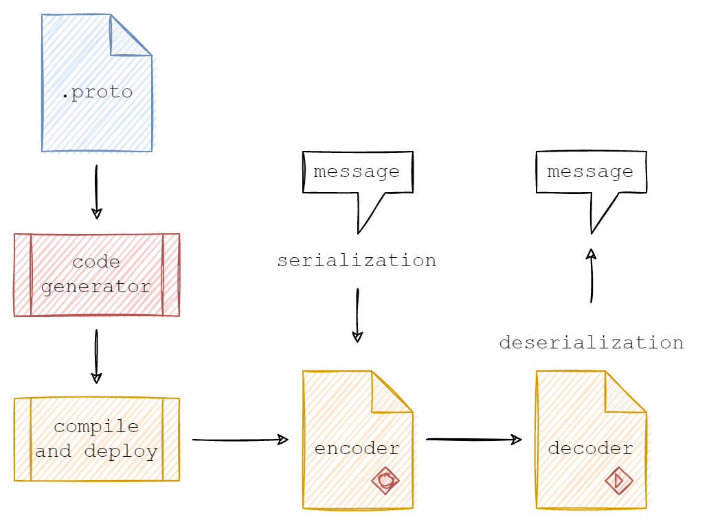

# Protocol Buffer

A `protobuf`, short for **Protocol Buffers**, is a **language-neutral and platform-neutral method** for **serializing structured data**.

This means it provides :

- a way to efficiently convert data,
- organized in a specific structure,
- into a format suitable for storage, transmission, or exchange
- between different programs and platforms.

---

## What it does:

- **Defines data structure:**
  - You define the structure of your data (like specifying its fields and types) in a special file called a `.proto` file.
- **Serializes data:**
  - It converts the data in this defined structure into a compact and efficient binary format (stream of bytes). This is similar to how other formats like JSON or XML represent data, but protobuffers are generally smaller and faster to work with.
- **Deserializes data:**
  - When needed, the data can be converted back from this binary format into its original structured form.

---

## Benefits of using protobuffers:

- **Smaller size:**
  - Compared to other formats like JSON or XML, protobuffers are more compact and require less storage space. This is especially beneficial when dealing with large datasets or network communication. Smaller data size compared to other formats like XML and JSON, leading to faster transmission and storage.
- **Faster processing:**
  - Serializing and deserializing data with protobuffers is generally faster than other options, making it efficient for scenarios where performance is crucial.
- **Language and platform independence:**
  - The `.proto` definition is independent of any specific programming language or platform. Code for working with the data is generated based on the definition, making it usable across different environments. Works across different programming languages and platforms.
- **Forward and backward compatibility:**
  - Adding new fields to the `.proto` definition doesn't break existing programs that use older versions of the data structure. This makes it easier to evolve the data format without causing disruptions.
- **Type Safety:**
  - Enforces data types, reducing errors during data exchange.

---

## Common use cases of protobuffers:

- **Network communication:**
  - Protobuffers are widely used in API communication for exchanging data between services and applications. Their efficiency and compatibility make them ideal for network transmissions.
- **Data storage:**
  - Protobuffers can be used to store structured data efficiently, particularly when space is a concern.
- **Configuration files:**
  - Protobuffers can define the structure of configuration files used by various applications, ensuring consistent data representation.

---

Protobuffers offer a powerful and efficient way to manage structured data across different environments, making them a popular choice for developers in various applications.

---

**Components:**

1. **.proto file:**
   - This is a text file that defines the structure of your data. It uses a specific syntax to specify data types (e.g., integer, string) and how they are organized in messages.
2. **Protocol Buffer Compiler:**
   - This is a tool that takes the `.proto` file as input and generates code for your chosen programming language.
3. **Generated Code:**
   - This code provides classes and functions to interact with the data defined in the `.proto` file. It simplifies working with the data by providing methods for setting, getting, and encoding/decoding the data.
4. **Applications:**
   - These are your programs using the generated code. They can be written in different languages, thanks to the language-neutral nature of protocol buffers.

---

## Data Flow:

1. **Define data structure:**
   - You define your data structure in the `.proto` file.
2. **Compile .proto file:**
   - Run the protocol buffer compiler to generate code for your desired programming languages.
3. **Use generated code:**
   - Integrate the generated code into your applications.
4. **Encode data:**
   - Use provided methods to convert your data structure into a compact binary format (serialization).
5. **Transmit/Store data:**
   - You can transmit the encoded data across a network or store it in a file.
6. **Decode data:**
   - Use the generated code to convert the received/retrieved data back into its original structure (deserialization).
7. **Access data:**
   - Use the decoded data within your applications.

---

## Diagrams:



## Links:

https://protobuf.dev/

---

The Protocol Buffers schema for the person object might look something like this:

```proto
message Person {
  required string user_name = 1;
  optional int64 favourite_number = 2;
  repeated string interests = 3;
}
```

When we encode the data above using this schema, it uses 33 bytes, as follows:


Look exactly at how the binary representation is structured, byte by byte.

- The person record is just the concatentation of its fields.
- Each field starts with a byte that indicates its tag number (the numbers 1, 2, 3 in the schema above), and the type of the field.
- If the first byte of a field indicates that the field is a string, it is followed by the number of bytes in the string, and then the UTF-8 encoding of the string.
- If the first byte indicates that the field is an integer, a variable-length encoding of the number follows.
- There is no array type, but a tag number can appear multiple times to represent a multi-valued field.

This encoding has consequences for schema evolution:

- There is no difference in the encoding between optional, required and repeated fields (except for the number of times the tag number can appear).
- This means that you can change a field from optional to repeated and vice versa (if the parser is expecting an optional field but sees the same tag number multiple times in one record, it discards all but the last value).
- required has an additional validation check, so if you change it, you risk runtime errors (if the sender of a message thinks that it’s optional, but the recipient thinks that it’s required).
- An optional field without a value, or a repeated field with zero values, does not appear in the encoded data at all — the field with that tag number is simply absent.
- Thus, it is safe to remove that kind of field from the schema. However, you must never reuse the tag number for another field in future, because you may still have data stored that uses that tag for the field you deleted.
- You can add a field to your record, as long as it is given a new tag number.
- If the Protobuf parser parser sees a tag number that is not defined in its version of the schema, it has no way of knowing what that field is called.
- But it does roughly know what type it is, because a 3-bit type code is included in the first byte of the field.
- This means that even though the parser can’t exactly interpret the field, it can figure out how many bytes it needs to skip in order to find the next field in the record.
- You can rename fields, because field names don’t exist in the binary serialization, but you can never change a tag number.

- This approach of using a tag number to represent each field is simple and effective.
